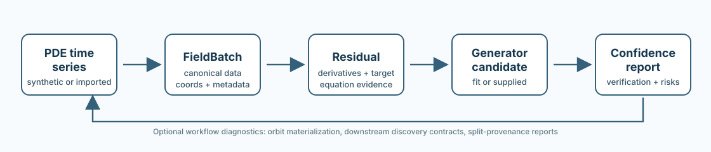

# PDELie

[](https://github.com/alexgabel/pdelie/actions/workflows/ci.yml)


PDELie is a research library for empirical Lie-symmetry workflows on controlled PDE time-series data. It turns canonical scalar 1D periodic fields into residuals, generator candidates, verification reports, confidence summaries, invariant/orbit diagnostics, and downstream discovery reports.



The current stable release is `v0.25.0` / **V0.25**: a KdV scope decision and guardrail hardening release. PDELie keeps KdV public support frozen to the normalized scalar 1D periodic short-horizon strong path, while documenting diagnostic-only evidence for broader KdV regimes and weak KdV feasibility.

## Install

Core editable install:

```bash
python -m pip install -e .
```

CI/test/tutorial install:

```bash
python -m pip install -e .[test]
```

Focused optional extras:

```bash
python -m pip install -e .[viz]         # Matplotlib plotting helpers
python -m pip install -e .[xarray]      # xarray.DataArray ingestion
python -m pip install -e .[downstream]  # narrow PySINDy bridge path
```

The downstream path is intentionally narrow and currently validated on the PySINDy 1.x / scikit-learn 1.2.x line under Python `<3.12`.

## 60-Second Example

```python
from pdelie.data import generate_heat_1d_field_batch, split_batch_train_heldout
from pdelie.derivatives import compute_spectral_fd_derivatives
from pdelie.residuals import HeatResidualEvaluator
from pdelie.symmetry import fit_translation_generator
from pdelie.verification import verify_translation_generator
from pdelie.reporting import (
    summarize_generator_confidence,
    summarize_generator_fit_diagnostics,
    summarize_residual_batch,
    summarize_verification_report,
)

field = generate_heat_1d_field_batch(batch_size=5, num_times=33, num_points=64, seed=0)
train, heldout = split_batch_train_heldout(field, train_size=2, seed=1)

evaluator = HeatResidualEvaluator()
derivatives = compute_spectral_fd_derivatives(train)
residual = evaluator.evaluate(train, derivatives)
generator = fit_translation_generator(train, evaluator, epsilon=1e-4)
verification = verify_translation_generator(heldout, generator, evaluator)

confidence = summarize_generator_confidence(
    residual=summarize_residual_batch(residual),
    generator=generator,
    fit_diagnostics=summarize_generator_fit_diagnostics(generator),
    verification=summarize_verification_report(verification),
    thresholds={"residual_rms": 1e-5, "verification_first_error": 5e-4},
)

print(confidence["confidence_label"])
print(confidence["component_statuses"])
```

## Tutorial Path

New users should start with `notebooks/`. The recommended first pass is:

1. `notebooks/00_pde_timeseries_to_generators.ipynb` - PDE time series to generator evidence.
2. `notebooks/02_robustness_sweeps.ipynb` - residual, fit, span, and verification diagnostics under perturbation.
3. `notebooks/06_orbit_coverage_diagnostics.ipynb` - invariant coverage, consistency, read-only orbit reports, and materialized orbit batches.

The notebooks are tutorials, not API contracts. They do not define train/test policy, leakage safety, threshold policy, or manuscript success criteria.

## Stable Scope

PDELie is intentionally conservative. The stable `v0.x` surface currently covers:

- canonical objects: `FieldBatch`, `DerivativeBatch`, `ResidualBatch`, `GeneratorFamily`, `InvariantMapSpec`, `VerificationReport`
- uniform rectilinear grids, with the strongest support for scalar 1D periodic fields
- synthetic Heat, Burgers, normalized short-horizon KdV, Fisher-KPP reaction-diffusion tagged as `reaction_diffusion_fisher_kpp`, and constant-coefficient advection-diffusion tagged as `advection_diffusion_constant_coefficient`
- `spectral_fd` derivatives through `u_xxxx`
- polynomial translation-generator fitting and finite-transform verification
- JSON-compatible reporting helpers for residuals, weak reports, weak supportability, fits, verification, confidence, readiness, invariant workflows, downstream discovery contracts, and split-provenance diagnostics
- uniform `x`-translation coverage, consistency, read-only orbit reports, and materialized orbit batches
- empirical validation of `GeneratorFamily`, `InvariantMapSpec`, and safe formula-backed `FormulaGeneratorFamily` candidates
- narrow structured ingestion through `from_numpy(...)` and optional `from_xarray(...)`
- narrow optional downstream support through PySINDy bridge utilities and backend-neutral discovery reports

The authoritative public surface is documented in [`docs/specs/API_STABILITY.md`](docs/specs/API_STABILITY.md).

Selected runtime helpers include:

- `pdelie.reporting.summarize_generator_fit_diagnostics`
- `pdelie.invariants.compute_periodic_window_coverage`
- `pdelie.invariants.diagnose_uniform_translation_consistency`
- `pdelie.reporting.summarize_invariant_workflow`
- `pdelie.invariants.summarize_uniform_translation_orbit`
- `pdelie.invariants.build_uniform_translation_orbit_batch`
- `pdelie.invariants.OrbitBatchResult`
- `pdelie.symmetry.validate_symmetry_candidate`
- `pdelie.symmetry.FormulaGeneratorFamily`
- `pdelie.reporting.summarize_generator_confidence`
- `pdelie.reporting.summarize_field_batch_readiness`
- `pdelie.discovery.summarize_discovery_bridge_output`
- `pdelie.reporting.summarize_downstream_discovery_workflow`
- `pdelie.reporting.summarize_split_leakage_provenance`
- `pdelie.reporting.summarize_weak_form_supportability`

## What PDELie Is Not

PDELie is not:

- a mathematical proof engine
- a neural symmetry-detector training framework
- a broad PDEBench/The Well adapter layer
- a general nonuniform or multidimensional PDE framework
- a split manager, leakage-prevention tool, or benchmark policy layer
- an operator-learning framework
- a paper-specific experiment pipeline

KdV remains intentionally frozen to the normalized scalar 1D periodic short-horizon strong path: no custom KdV initial-condition API, configurable KdV coefficients, general KdV regime support, or weak KdV API is promoted. KS remains internal feasibility/no-go evidence, including an internal KS diagnostic sweep; no stable KS runtime API is promoted. Weak-form methods beyond the frozen Heat/Burgers weak-report slice and `v0.24` supportability reporting layer remain deferred.

## Examples

Packaged examples print JSON-compatible runtime summaries:

```bash
python -m pdelie.examples.heat_vertical_slice
python -m pdelie.examples.kdv_vertical_slice
python -m pdelie.examples.kdv_scope_decision
python -m pdelie.examples.reaction_diffusion_vertical_slice
python -m pdelie.examples.advection_diffusion_vertical_slice
python -m pdelie.examples.orbit_coverage_diagnostics
python -m pdelie.examples.invariant_workflow_summary
python -m pdelie.examples.translation_orbit_batch
python -m pdelie.examples.symmetry_candidate_validation
python -m pdelie.examples.formula_generator_validation
python -m pdelie.examples.generator_confidence_report
python -m pdelie.examples.external_data_readiness
python -m pdelie.examples.downstream_discovery_contracts
python -m pdelie.examples.split_leakage_provenance
python -m pdelie.examples.weak_form_supportability
```

These are smoke/reporting examples, not canonical artifact schemas.

## Validation

The current release is validated by:

- the explicit `v0_25-release-gate` CI job
- full editable `python -m pytest`
- built-wheel package smoke
- packaged example smoke
- notebook structural validation through `python scripts/check_notebooks.py`
- `git diff --check`

Package-index publishing is deferred until `v1.0` or later. Current `v0.x` releases are Git-tag-only.

## Documentation

- Docs index: [`docs/README.md`](docs/README.md)
- Contracts and specs: [`docs/specs/`](docs/specs/)
- Public API stability: [`docs/specs/API_STABILITY.md`](docs/specs/API_STABILITY.md)
- Roadmap and planning: [`docs/planning/`](docs/planning/)
- Release readiness: [`docs/releases/`](docs/releases/)
- Tutorials: [`notebooks/README.md`](notebooks/README.md)
- Contributor guide: [`CONTRIBUTING.md`](CONTRIBUTING.md)
